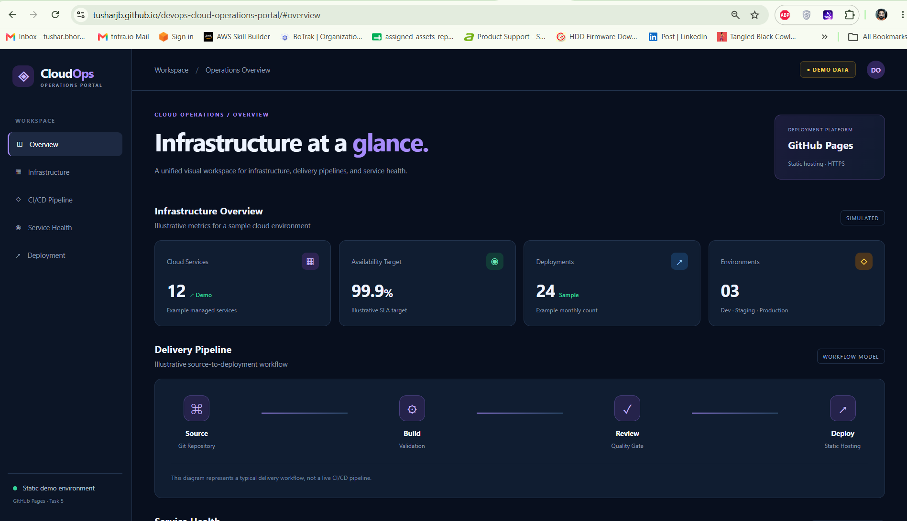
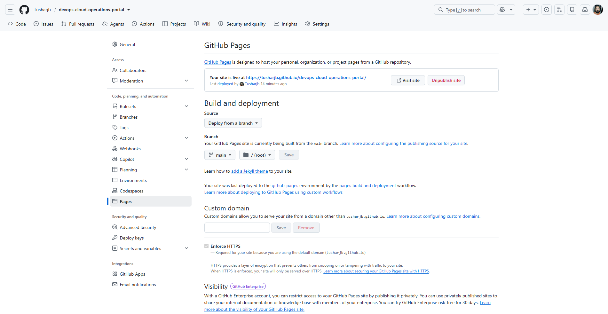

# CloudOps — DevOps Cloud Operations Portal

A responsive, cloud-inspired static website built with **HTML5, CSS3, and JavaScript**, deployed publicly using **GitHub Pages** as part of DevOps Internship Task 5.

[](https://tusharjb.github.io/devops-cloud-operations-portal/)


---

## Live Deployment

**Website:** https://tusharjb.github.io/devops-cloud-operations-portal/

**Repository:** https://github.com/Tusharjb/devops-cloud-operations-portal

The website is hosted on GitHub Pages using the `main` branch and the repository root directory, with HTTPS enabled.

## Project Overview

CloudOps is a static DevOps operations dashboard that visually demonstrates common cloud infrastructure, delivery, and service monitoring concepts.

The project showcases how a responsive website can be developed locally, managed using Git, published to GitHub, and deployed using GitHub Pages without maintaining a web server.

All infrastructure statistics and service health indicators are **simulated demonstration data**, not live cloud monitoring.

## Application Preview



## Features

- **Infrastructure Overview:** Illustrative cloud service metrics, availability targets, deployment counts, and environments.
- **CI/CD Pipeline Visualization:** A conceptual Source → Build → Review → Deploy workflow.
- **Service Health:** Example health indicators for API Gateway, PostgreSQL, and CI/CD services.
- **Deployment Information:** Hosting architecture and technology details.
- **Responsive Interface:** Dark-themed layout with navigation suitable for desktop and smaller screens.
- **Static Architecture:** No backend server, database, or paid hosting service required.

## Technology Stack

| Technology | Purpose |
|---|---|
| HTML5 | Website structure |
| CSS3 | Styling and responsive layout |
| JavaScript | Basic client-side interactions |
| Git | Local version control |
| GitHub | Source code repository |
| GitHub Pages | Public static website hosting |

## Deployment Architecture

```text
Local Development
       |
       v
Git Repository
       |
       v
GitHub Repository
       |
       v
main Branch / Root Directory
       |
       v
GitHub Pages Build & Deployment
       |
       v
Public HTTPS Website
```

## GitHub Pages Configuration

| Configuration | Value |
|---|---|
| Deployment source | Deploy from a branch |
| Branch | `main` |
| Folder | `/(root)` |
| Hosting | GitHub Pages |
| HTTPS | Enabled |
| Website type | Static |

### Deployment Evidence



## Project Structure

```text
Task-5-GitHub-Pages/
|
|-- index.html
|-- style.css
|-- script.js
|-- .gitignore
|-- README.md
|
`-- screenshots/
    |-- live-website.png
    `-- github-pages-deployment.png
```

## Run Locally

Clone the repository:

```bash
git clone https://github.com/Tusharjb/devops-cloud-operations-portal.git
```

Enter the project directory:

```bash
cd devops-cloud-operations-portal
```

Open `index.html` in a modern web browser.

No package installation or build command is required.

## Deployment Steps

1. Develop the static website using HTML, CSS, and JavaScript.
2. Initialize Git and commit the website source files.
3. Create a public GitHub repository.
4. Push the source code to the `main` branch.
5. Open **Repository Settings → Pages**.
6. Select **Deploy from a branch**.
7. Choose `main` and `/(root)`, then save.
8. Wait for the GitHub Pages deployment to complete.
9. Open the public website URL and verify the deployment.

## Verification

The deployed website was checked for:

- Successful public access through GitHub Pages
- Correct HTML and CSS rendering
- Functional navigation between dashboard sections
- Display of infrastructure, pipeline, and service health sections
- HTTPS-enabled public hosting
- Correct deployment configuration

## Project Outcome

Successfully developed and deployed a responsive static website using GitHub Pages.

The project demonstrates Git-based source management, static website deployment, public hosting, and basic frontend implementation without using paid infrastructure.

---

**DevOps Internship | Task 5 — Host a Static Website with GitHub Pages**